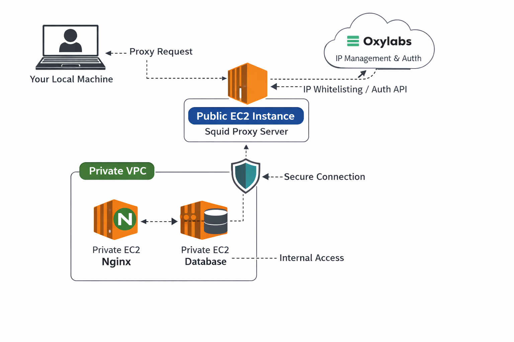
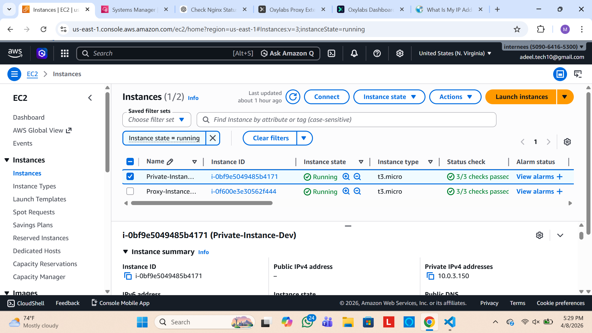
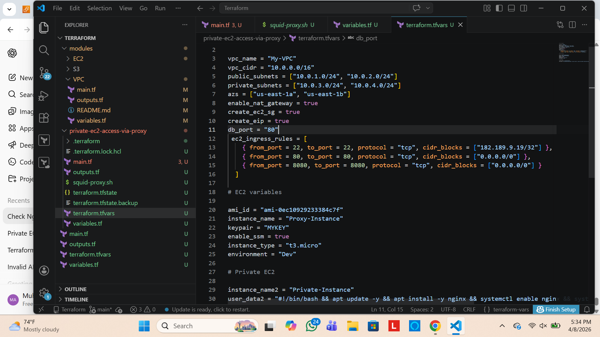
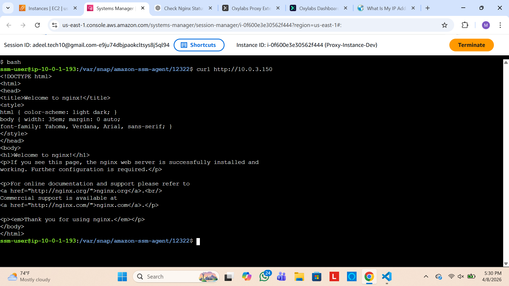

# ProxyBridge

A Squid-based proxy solution to securely access private EC2 instances via a public proxy using Oxylabs, entirely built and managed with Terraform without any manual console usage.

## Overview

ProxyBridge sets up a public EC2 instance as a Squid proxy that routes traffic to private EC2 instances within a VPC. This enables controlled and secure access to internal resources while keeping the entire architecture fully automated using Terraform.

## Features

- Fully provisioned with Terraform (no manual console usage)  
- Public EC2 instance configured as a Squid proxy  
- Private EC2 instances running Nginx (or any other services)  
- Secure access to private resources via proxy  
- Optional integration with Oxylabs for IP management and authentication  

## Architecture

[Your Local Machine]  
         |  
         v  
[Public EC2 - Squid Proxy] ---[Security Group]---> [Private EC2 - Nginx]

## Screenshots

### Architecture Diagram
 

### Terraform Plan & Apply
  
  

### Proxy Access Example
  


## Requirements

- Terraform >= 1.5.x  
- AWS Account with access to create EC2, VPC, Security Groups, and IAM roles  
- Oxylabs account (optional, for proxy IP management)  

## Usage

1. Clone the repository:  
   ```bash
   git clone https://github.com/yourusername/proxybridge.git
   cd proxybridge
   ```

2. Initialize Terraform:  
   ```bash
   terraform init
   ```

3. Apply the Terraform configuration:  
   ```bash
   terraform apply
   ```
   (Confirm the resources creation when prompted.)

4. Access the private instance via the public proxy using Squid:  
   ```bash
   curl -x http://<proxy-user>:<password>@<public-ec2-ip>:8080 http://<private-ec2-ip>
   ```

## Notes

- Ensure your security groups allow traffic between public and private instances.  
- You can extend this project to include SSL, custom domains, or multiple proxies.  
- This setup ensures your private instances are never directly exposed to the internet.

## License

MIT License